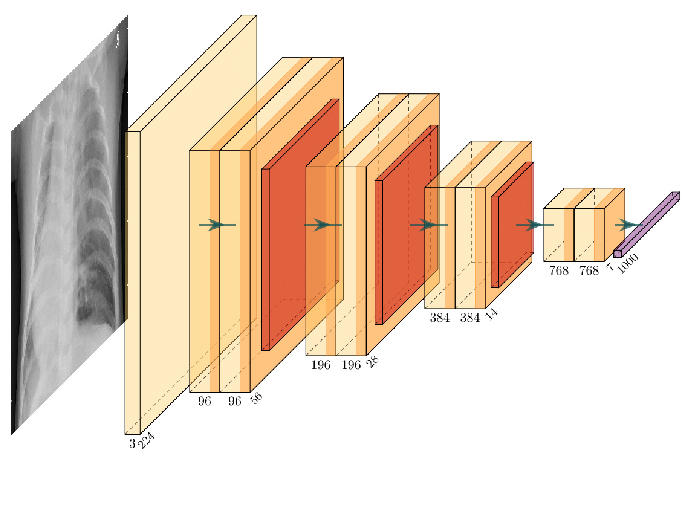
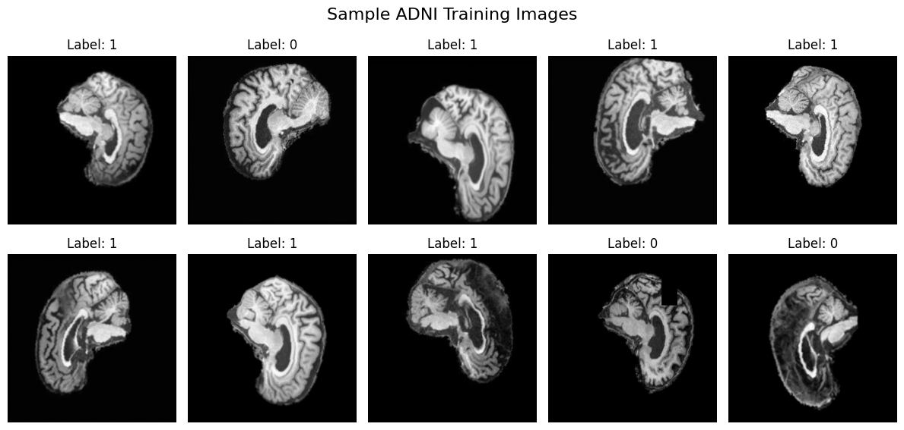
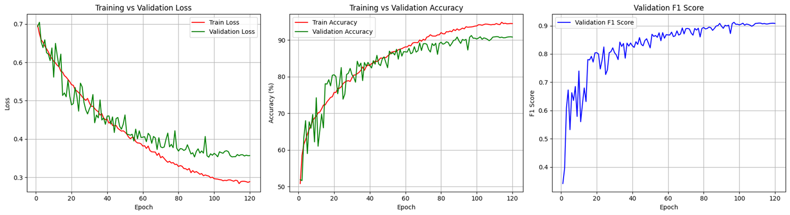
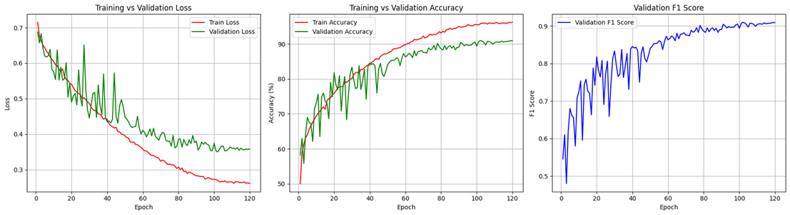
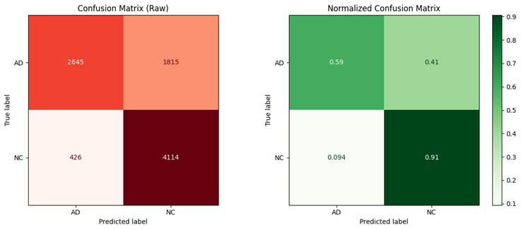
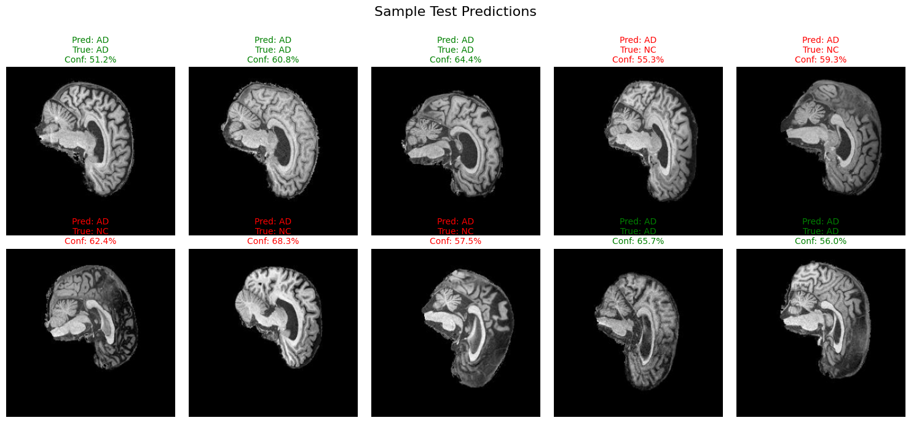

# Introduction

The diagnoses of brain illnesses are conventionally carried out through either invasive biopsy procedures or manual examination of medical images subject to human error. The need for a reliable, robust, and non-invasive approach to medical brain examination is apparent.

Thus, this project aims to investigate the viability of ConvNeXt, a state-of-the-art convolutional neural network (CNN) image classifier, for identifying Alzheimer’s disease (AD) from medical imaging data. The model was trained and evaluated using the ADNI dataset, which contains two-dimensional MRI brain scans of both normal cognitive (NC) and Alzheimer’s disease (AD) patients. The goal was to achieve a **test accuracy of at least 80%** using a ConvNeXt model to classify the ADNI dataset.

# ConvNeXt

ConvNeXt is a modern CNN architecture developed from ResNet that's designed to compete with Vision Transformers (ViTs) by adopting several Transformer-inspired design principles while retaining a purely convolutional structure. Its main advantages over ViTs are lower data requirements and reduced computational complexity, making it well-suited for medical imaging tasks where datasets are often limited. These properties allow ConvNeXt to achieve strong performance while minimizing overfitting. Furthermore, through transfer learning (using pretrained weights from large-scale medical image datasets) ConvNeXt models have demonstrated promising accuracy in classifying MRI brain scans and detecting early signs of Alzheimer’s disease.

## ConvNeXt Architecture

<p align="center">
    
</p>

The architecture of the model begins with a stem composed of a `4×4` convolutional layer with stride `4`. This stem reduces the dimensions of the input image by a factor of four while increasing the channel depth to `96`, resulting in a higher-dimensional feature space. This aggressive reduction effectively *patchifies* the image, designed to mirror the patch embedding used in Vision Transformers. Each `4×4` receptive field acts as an individual patch, similar to the `16×16` patch segmentation used by many ViT models.

<p align="center">
    
</p>

Following the stem are four hierarchical stages of ConvNeXt blocks. Each stage progressively reduces the spatial resolution while increasing the number of channels. Between every two stages, `2×2` convolutional downsampling layers with stride `2` halve the spatial dimensions and double the number of channels. Together, these layers form a feature pyramid that expands the model’s receptive field, enabling local to global feature learning.  

After the final stage, a global average pooling layer condenses each feature map into a single value per channel. Layer normalization is applied before being fed to the fully connected classification head which outputs logits for binary classification. Optional dropout may be applied to the head to mitigate overfitting.

### Stage Summary

- **Patchify Stem:** `4×4` convolution, stride `4` = `(96 × H/4 × W/4)`
- **Downsample 1:** `2×2` convolution, stride `2` = `(192 × H/8 × W/8)`
- **Downsample 2:** `2×2` convolution, stride `2` = `(384 × H/16 × W/16)`
- **Downsample 3:** `2×2` convolution, stride `2` = `(768 × H/32 × W/32)`

## ConvNeXt Block

Each ConvNeXt block begins with a `7×7` depthwise convolution, providing a large receptive field to capture broad spatial context. A LayerNorm operation follows to stabilize gradients and maintain numerical consistency. The block then employs an inverted bottleneck structure created from two `1×1` pointwise convolutions with a GELU activation in-between. The first `1×1` convolution expands the channel dimension by a factor of four, and the second reduces it back to the original size, enabling efficient nonlinear channel mixing while maintaining computational efficiency.

Each block also includes a residual connection that adds the input to the output, allowing gradient flow and improving convergence. DropPath regularization is used to randomly drop entire residual branches during training, further increasing generalization. Some ConvNeXt implementations also introduce LayerScale, a set of small learnable scalars applied to residual outputs to stabilize deep training.

Of note, compared to a regular CNN, ConvNeXt uses layer normalization instead of batch normalization and the GELU activation function instead of ReLU. These changes produce smoother nonlinear responses and result in more stable optimization.

### Block Structure

- `7×7` depthwise convolution  
- Layer normalization  
- `1×1` expansion convolution (increased by a factor of 4)  
- GELU activation  
- `1×1` contraction convolution (decreased by a factor of 4)  
- Residual connection with DropPath regularization

## ConvNeXt Tiny

ConvNeXt-Tiny is the smallest architectural variant of the ConvNeXt family introduced by Facebook. Compared to larger models such as ConvNeXt-Small and ConvNeXt-Large, it employs three ConvNeXt blocks in the first, second, and fourth stages, and nine blocks in the third stage, resulting in an overall structure of `[3, 3, 9, 3]`. As a result, ConvNeXt-Tiny contains the fewest trainable parameters among the variants. This is why it was selected for this application due to the limited size of the available dataset.

# ADNI Dataset

<p align="center">
    
</p>

<p align="center">
    
</p>

The ADNI dataset contains two-dimensional grayscale MRI brain scan images divided into two categories: normal cognitive (NC) and Alzheimer’s disease (AD) patients. Each image has dimensions of 256 by 240 pixels. Data were collected from 1,051 patients, with 20 distinct scans available per patient. The dataset is provided in two prepared subsets: a training set containing 21,520 samples and a testing set containing 9,000 samples. The class distribution between AD and NC is roughly equal in both subsets, but there is some discrepancy. The data is structured in its folder as follows:

```
AD_NC  
├── test  
│   ├── AD  
│   └── NC  
└── train  
    ├── AD  
    └── NC  
```

## Data Split

20% of the pre-prepared training data was set aside to create the validation set. It was important to create a validation set as it allowed for hyperparameter tuning while the remaining training data could be used to train the model’s internal parameters. Although it's possible to validate the model using the testing set, keeping the testing set isolated from the training process enables us to get a more realistic evaluation of the model, as it's unlikely in real life that the model's hyperparameters will be allowed to be tuned on the test data.

| Dataset                                | AD Samples | NC Samples | Total  |
|----------------------------------------|-------------|-------------|--------|
| **Training Set**                       | 10,400      | 11,120      | 21,520 |
| **Testing Set**                        | 4,460       | 4,540       | 9,000  |
| **Split Training Set (after split)**   | 8,320       | 8,920       | 17,240 |
| **Validation Set**                     | 2,080       | 2,200       | 4,280  |

To avoid data leakage, the validation set was drawn from the training data rather than from the test set. The initial split of the training data was stratified only by class to maintain similar class proportions across subsets. However, early experiments revealed abnormally high validation scores due to patient overlap between the training and validation sets. To address this, the dataset was **re-split by patient ID**, ensuring that scans from the same individual appeared in only one subset at a time. This successfully prevented data leakage between the validation and test sets.

## Data Augmentation

Two collections of image transformations were applied to the data during preprocessing.
The first consisted of deterministic transforms, applied consistently to all datasets. This included resizing and padding the images to 256×256 pixels and normalizing their pixel intensities. A mean of 0.263 and a standard deviation of 0.271 were used for normalization, derived from related studies (see reference 4). Images were also converted to single-channel grayscale within the custom data loader, as the MRI scans were predominantly monochromatic.

```python
eval_tf = transforms.Compose([
        transforms.Pad((8, 0, 8, 0)),
        transforms.Resize((256, 256)),
        transforms.ToTensor(),
        transforms.Normalize(mean=[mean], std=[std]),
    ])
```

<p align="center">
    
</p>

The second category consisted of random augmentations applied only to the training set to increase data diversity and reduce overfitting. These included:

- **Random resized crops, horizontal flips, rotations, and affine transformations** to simulate variations in orientation and scale found in real medical imaging.
- **Random erasing and resized crops** to obscure regions of the image, encouraging the model to learn generalized features rather than memorizing specific patterns.
- **Gaussian blur and color jitter** to mimic variations in brightness and image fidelity, improving robustness to noise and imaging inconsistencies.

These augmentations aimed to enhance regularization and improve the model’s generalizability to unseen medical data.

```python
train_tf = transforms.Compose([
        transforms.Pad((8, 0, 8, 0)),
        transforms.RandomResizedCrop(256, scale=(0.8, 1.0)),
        transforms.RandomHorizontalFlip(p=0.5),
        transforms.RandomRotation(10),
        transforms.GaussianBlur(kernel_size=3, sigma=(0.1, 1.0)),
        transforms.ColorJitter(brightness=0.1, contrast=0.1),
        transforms.RandomAffine(degrees=0, translate=(0.05, 0.05)),
        transforms.ToTensor(),
        transforms.RandomErasing(p=0.2, scale=(0.01, 0.05)),
        transforms.Normalize(mean=[mean], std=[std]),
    ])
```

# Model

A ConvNeXt-Tiny model was defined and trained on the dataset. The architecture consisted of convolutional block stages of `[3, 3, 9, 3]` with corresponding channel dimensions of `[96, 192, 384, 768]`. The number of input channels was set to `1` to accommodate the grayscale image data, and the drop path rate was set to `0.1` to improve regularization and reduce overfitting.

## Hyperparameters

- Optimizer: The **AdamW** optimizer was selected based on its effectiveness in similar studies. Compared to conventional CNNs, AdamW is used over Stochastic Gradient Descent (SGD) because it decouples weight decay from gradient updates, providing more stable convergence for ConvNeXt models.
- Loss Function: **CrossEntropyLoss** was used for binary classification. This function combines log-softmax and negative log-likelihood to emphasise differences in prediction confidence and penalise confident but incorrect predictions.
- Learning Rate Scheduler: The scheduler used a **linear warmup** phase followed by **cosine annealing**. The warmup stabilized early training, while the cosine decay enabled smoother convergence for later epochs.
- Label Smoothing: `0.1`
- Learning Rate: `2.5e-4`
- Weight Decay: `1e-4`
- Number of Epochs: `120`
- Warmup Epochs: `10`
- Patience: `20`
- Batch Size: `128`
- Number of Workers: `8`

### Additional Optimizations

To address the slight class imbalance in the dataset, class weights were incorporated into the loss function. These weights were calculated based on the inverse frequency of each class, being `1.0336` for AD and `0.9684` for NC. A patience mechanism was also implemented so that if the model failed to improve for a specified number of epochs, training would automatically stop.

# Results

## Attempt 1

After 120 epochs of training, the model achieved a training accuracy of 94.48% and a final validation accuracy of 90.81%. The highest validation accuracy recorded during training was 91.23%.

<p align="center">
    
</p>

Plots of loss and accuracy indicate that the validation accuracy initially exceeded the training accuracy up to approximately 30 epochs, after which the training accuracy began to surpass it. The validation accuracy showed great instability in the early stages of training, suggesting that the initial learning rate may have been set too high. This likely caused the optimiser to over-adjust the network’s weights and biases. The instability began to subside after about 60 epochs, once the cosine annealing learning rate scheduler had reduced the learning rate sufficiently to stabilise optimisation.

Between epochs 80 and 100, the training and validation accuracies both plateaued, with training accuracy remaining consistently higher than validation accuracy.

```python
Evaluating best model on test set
Testing: 100%|██████████| 71/71 [00:14<00:00,  5.05it/s]
Test Accuracy: 74.8667%

Classification Report:
              precision    recall  f1-score   support

          AD     0.8552    0.5933    0.7006      4460
          NC     0.6929    0.9013    0.7835      4540

    accuracy                         0.7487      9000
   macro avg     0.7740    0.7473    0.7420      9000
weighted avg     0.7733    0.7487    0.7424      9000
```

Evaluation on the test set showed an overall accuracy of 74.86%, which fell short of the target accuracy of 80%. The classification report revealed that the AD class achieved a strong precision score of 0.85, indicating that most predictions labelled as Alzheimer’s disease were correct. However, recall for this class was relatively low at 0.59, meaning a substantial number of true Alzheimer’s cases were misclassified as non-demented. In contrast, the NC class exhibited higher recall than precision, suggesting that most of the images predicted as healthy were indeed correct.

<p align="center">
    
</p>

The confusion matrix confirmed this trend, showing that many AD-class images were incorrectly classified as NC, leading to a high number of false negatives.

The model’s reduced accuracy could be attributed to domain shift between the training/validation and test datasets, as MRI scans often vary in brightness and contrast across different sessions and machines. Another factor may have been overfitting during later epochs, where the training accuracy continued to rise while validation performance stagnated.

## Attempt 2
To enhance regularisation and improve long-term generalisation, a dropout layer (30% rate) was added to the head of the ConvNeXt model.

```python
self.head = nn.Sequential(
            nn.Dropout(0.3),
            nn.Linear(dims[-1], num_classes)
    )
        
self.apply(self._init_weights)

self.head[1].weight.data.mul_(head_init_scale)
self.head[1].bias.data.mul_(head_init_scale)
```

By randomly disabling channels within the linear layer, the model was encouraged to learn relationships across a broader range of features rather than over-relying on specific ones.

<p align="center">
    
</p>

When retrained for another 120 epochs, the model achieved an increased training accuracy of 96.22%, but a slight decrease in validation accuracy to approximately 91%. The learning curves indicated that training was more stable after 50 epochs, though some instability persisted during earlier epochs.

```Python
Evaluating best model on test set...
Testing: 100%|██████████| 71/71 [00:14<00:00,  5.05it/s]
Test Accuracy: 75.1000%

Classification Report:
              precision    recall  f1-score   support

          AD     0.8613    0.5930    0.7024      4460
          NC     0.6939    0.9062    0.7859      4540

    accuracy                         0.7510      9000
   macro avg     0.7776    0.7496    0.7442      9000
weighted avg     0.7768    0.7510    0.7446      9000
```

Evaluation on the test set demonstrated that the inclusion of dropout improved performance, achieving a test accuracy of 75.10%. The confusion matrix showed a slight increase in correctly classified Alzheimer’s cases, indicating that the addition of dropout reduced false negatives and improved the model’s generalisation. However, this is only a minor increase, suggesting that further improvements are necessary to meet the desired accuracy.

<p align="center">
    
</p>

A sample of predictions is shown below alongside the model's confidence.

<p align="center">
    
</p>

## Potential Improvements
Several approaches could be explored to improve the model’s accuracy, including:

- Implementing Mixup and CutMix: In these augmentation techniques, two different images from the training set are either blended or partially combined, with a new label assigned based on the proportion of each image. These methods help reduce the model’s overconfidence, create smoother decision boundaries, and encourage the model to learn a broader range of features.
- Using Exponential Moving Averages (EMA): EMA can help reduce the noise and instability observed during the early stages of training by updating model parameters gradually using aggregated historical values. This leads to more stable convergence and smoother performance trends.
- Adjusting the Decision Threshold: Plotting model accuracy against various decision thresholds can provide insight into how threshold adjustments affect class balance. This allows for fine-tuning of the classification boundary to achieve a better trade-off between sensitivity and specificity.

# Usage

## Steps to Run

To train the model, execute the `train.py` file.

```python
python train.py
```

Ensure that the folder containing both pre-prepared ADNI datasets is located in the same directory as train.py. After training is complete, the best model parameters will be automatically saved in this directory. The training script also evaluates the model on the test set and generates corresponding confusion matrices. To test a previously trained model or to generate sample predictions without retraining, run `predict.py` instead.

```python
python predict.py
```

**Note:** These files were developed using Google Colab.

## Required Dependencies

```python
# Core
import os
import re
import sys
import random
from collections import defaultdict, Counter

# Numbers and plotting
import numpy as np
import matplotlib.pyplot as plt

# Machine learning & metrics
from sklearn.model_selection import train_test_split
from sklearn.metrics import (
    classification_report,
    confusion_matrix,
    ConfusionMatrixDisplay,
    f1_score,
)

# Deep learning
import torch
import torch.nn as nn
import torch.nn.functional as F
import torch.optim as optim
from torch.utils.data import Dataset, Subset, DataLoader
from torch.optim.lr_scheduler import SequentialLR, LinearLR, CosineAnnealingLR

# Computer vision
import torchvision.transforms as transforms
from PIL import Image

# Progress bar
from tqdm import tqdm

# ConvNeXt model components
from timm.models.layers import trunc_normal_, DropPath
```

Versions used:

```python
torch==2.2.2
torchvision==0.17.2
timm==1.0.3
numpy==1.26.4
scikit-learn==1.4.2
pillow==10.2.0
matplotlib==3.8.3
tqdm==4.66.4
```
# References

1. Basereh, M 2025, ConvNeXt-Driven Detection of Alzheimer’s Disease: A Benchmark Study on Expert-Annotated AlzaSet MRI Dataset Across Anatomical Planes, bioRXiv, viewed 2 November 2025, <https://www.biorxiv.org/content/10.1101/2025.07.10.664260v1>.
2. Liu, Z, Mao, H, Wu, C-Y, Feichtenhofer, C, Darrell, T & Xie, S 2022, ‘A ConvNet for the 2020s’, arXiv:2201.03545 [cs].
3. Mehmood, Y & Bajwa, UI 2024, ‘Brain tumor grade classification using the ConvNext architecture’, DIGITAL HEALTH, vol. 10.
4. Rao, Y, Zhao, W, Zhu, Z, Zhou, J & Lu, J 2023, ‘GFNet: Global Filter Networks for Visual Recognition’, IEEE Transactions on Pattern Analysis and Machine Intelligence, vol. 45, IEEE Computer Society, no. 9, pp. 10960–10973.
